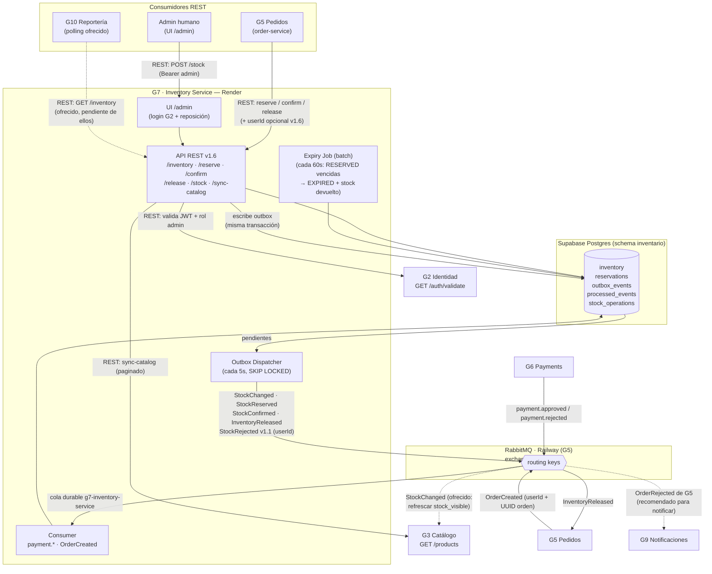

# Arquitectura — Inventory Service (Grupo 7) · E4 Integración

Estado real de las dependencias al cierre de E4. Los flujos marcados **REST** son
síncronos; los marcados **evento** viajan por el bus compartido del curso
(RabbitMQ en Railway administrado por G5, exchange topic `fishmarket`, routing key = eventType,
patrón Outbox con entrega *al menos una vez* — los consumidores deduplican por `eventId`).
Hasta el 2026-07-09 el bus fue CloudAMQP (`payments.events`); se migró al expirar su trial —
solo cambió configuración (`RABBITMQ_URL` / `RABBITMQ_EXCHANGE`), cero cambios de código.

## Decisiones clave (con su porqué)

| Decisión | Por qué |
|---|---|
| **Bus RabbitMQ compartido** en vez del plan original (Supabase Realtime, v1.0 del contrato) | Es el bus *de facto* del ecosistema: G5, G6 y G9 ya publican/consumen ahí. Un canal propio no tendría oyentes. Cambio versionado en contrato v1.4. La migración CloudAMQP→Railway (v1.6.1) probó que broker y exchange son pura configuración. |
| **Patrón Outbox** para publicar | El evento se confirma en la misma transacción que el cambio de stock: sin eventos fantasma si hay ROLLBACK. Entrega al menos una vez → deduplicación por `eventId` en consumidores. |
| **Concurrencia en la BD** (UPDATE condicional, `FOR UPDATE`, índice único parcial, `SKIP LOCKED`) | Resiste escalamiento horizontal: el lock vive en Postgres, no en el proceso. Sin sobreventa ni doble procesamiento aunque Render levante varias instancias. |
| **Doble identificador de orden** (`orderNumber` + `order_uuid`) | G5 nos llama por `orderNumber` pero en el bus su orden viaja como UUID; guardamos ambos (via su `OrderCreated`) y resolvemos venga el que venga. |
| **Consumo idempotente** (`processed_events`) | Caso obligatorio: un evento re-entregado no confirma/libera dos veces. |
| **Auth solo en la carga de stock** (JWT admin vía G2) | Reserva/confirmación/liberación son servicio-a-servicio (G5) y las lecturas son públicas para el ecosistema; la única vía de entrada de stock exige rol admin. Fail closed si G2 no responde. |
| **Batch de expiración** | Reservas con TTL vencido devuelven su stock y publican `InventoryReleased (reason EXPIRED)`; un pago tardío recibe 409 (correcto). |

## Estado de cada integración (cierre E4)

| Grupo | Canal | Estado |
|---|---|---|
| G2 Identidad | REST saliente (validate) | ✅ producción |
| G3 Catálogo | REST saliente (sync) · evento `StockChanged` ofrecido | ✅ / 🟡 su consumidor pendiente |
| G5 Pedidos | REST entrante (reserve/confirm/release) · eventos en ambos sentidos | ✅ producción |
| G6 Payments | Eventos entrantes (approved/rejected → confirm/release automático) | ✅ producción |
| G9 Notificaciones | Recomendado consumir `OrderRejected` de G5 (rename en curso) | 🟡 esperando a G5/G9 |
| G10 Reportería | REST `GET /inventory` ofrecido para su low-stock real | 🟡 pendiente de ellos |
